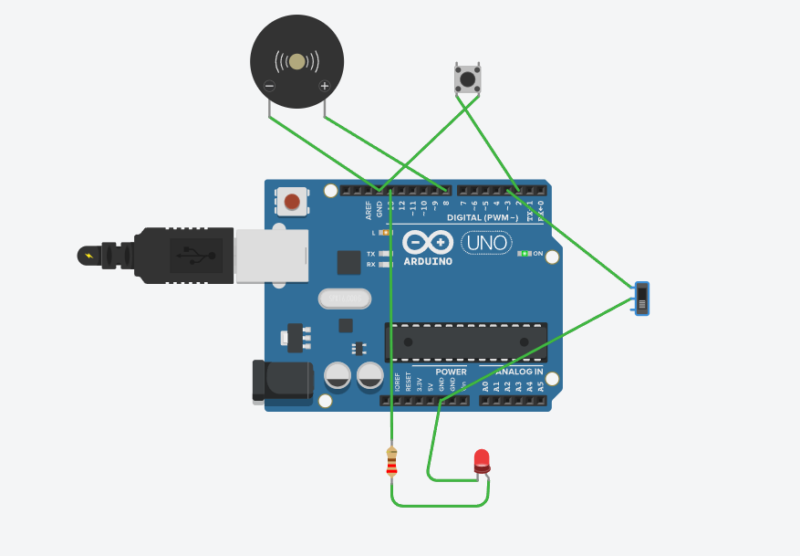

# Seat Belt Alert System 
An Arduino-based seat belt alert system that detects whether a person is seated and whether their seat belt is fastened. 
Triggers an audio and visual alert if belt is not fastened.

## Features
1. Detects seat occupancy via push button (simulates seat pressure sensor)
2. Detects belt buckle status via slide switch
3. Buzzer alert at 2800Hz when belt is not fastened
4. LED warning light blinks when alert is active
5. Serial Monitor output for real-time status
6. Three states: Seat Empty / Alert / Safe

## Components Used
Seat sensor (Pin 2)
Belt buckle (Pin 3)
Buzzer (Pin 8)
LED + 220Ω resistor (Pin 13)

## Circuit
All buttons/switches wired with INPUT_PULLUP
No external pull-down resistors needed
Simulated on Tinkercad




## Serial Monitor Output
```
System Ready.
SEAT EMPTY: No one in seat.
ALERT: Person seated, belt not fastened!
SAFE: Person seated and belt fastened correctly.
```

## How It Works
1. Seat sensor button pressed = person seated
2. If seated and belt switch OFF = alert triggers immediately
3. Buzzer beeps at 2800Hz in 600ms cycles
4. LED blinks rapidly as visual warning
5. Toggle belt switch ON = everything stops, safe message shown

## Simulation
Built and tested on Tinkercad Circuits.
Link: https://www.tinkercad.com/things/blLkk8v5BQ5-seatbelt-alert-system?sharecode=tPoJGYPufZ4OtDsuUtCr-CjwHIu2nuH4Z0zcj2keLOk

## Author
Gurshant Singh
